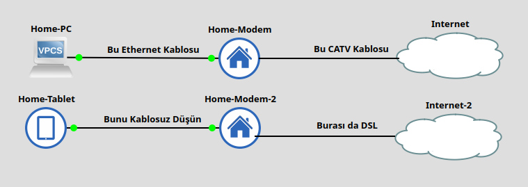
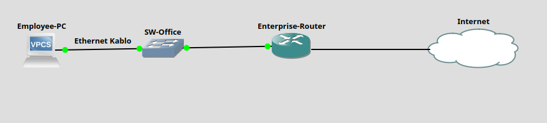

# Ağlara Bakış Açısı

CCNA yolculuğuna başlarken ilk yapmamız gereken şey şapkanı değiştirmek. 
Bugüne kadar sen bir ağ **kullanıcısıydın**; yani internete giren, video izleyen kişiydin. 
Ama artık bu ağı inşa eden **Network Engineer** (Ağ Mühendisi) olma yolundasın.

Ağ dediğimiz şey, senin evde kullandığın internet bağlantısına çok benzer temeller üzerine kuruludur. 
İki ana ev senaryosu ile başlayalım:

## 1. Home Kullanıcısı Bakış Açısı

Evde yüksek hızlı internete bağlanırken genelde iki teknoloji karşımıza çıkar.

### A. Cable Internet

Bu senaryo genellikle TV altyapısını kullanır.

* **Bağlantı Akışı:** Bilgisayarını bir **Ethernet cable** ile **Cable Modem**'e bağlarsın.
* **Duvar Bağlantısı:** Modem ise duvardaki **CATV** (Cable TV) çıkışına bağlanır.
* **Kablo Tipi:** Duvardan modeme gelen o yuvarlak kabloya **Coaxial Cable** diyoruz (Eski anten kabloları).
* **Avantajı:** Sürekli açıktır. Oturup hemen mail atabilir, sörf yapabilirsin.

### B. DSL (Digital Subscriber Line)

Bu senaryo telefon hattı altyapısını kullanır.

* **Bağlantı Akışı:** Tablet veya telefon kullanıyorsan kabloyla uğraşmazsın. **Wireless LAN** (veya yaygın adıyla **Wi-Fi**) kullanırsın.
* **Cihaz:** Burada merkezde bir **Router** vardır.
* **Teknoloji:** Router, internet ile konuşmak için **DSL** teknolojisini kullanır.



Burası için basit bir "Home Network" topolojisi kuracağız. Bir tarafta PC (Ethernet ile bağlı), diğer tarafta Tablet (Wi-Fi ile bağlı) ve bunları internete çıkaran bir Router simüle edeceğiz.

### Adım 1: Topoloji Kurulumu 

GNS3'te "Cable Modem" diye özel bir cihaz arama, bulamazsın. Çünkü ticari modemler aslında **Router**'ların özelleşmiş (ve ev için biraz kısıtlanmış) halleridir. Biz bir Router alıp ona modem kostümü giydireceğiz.

1. **Modem Rolü:** Sahneye bir Cisco Router (ben c7200 kullanıyorum) sürükle.
* *Görsel tüyo vereyim:* Cihaza sağ tıkla -> **Change Symbol** de ve arama kutusuna "house" veya "modem" yazıp o ikonu seç. (Maksat gözümüze gerçekçi gelsin).
* **Adını Değiştir:** `Home-Modem` yap.

2. **PC Rolü:** Sahneye bir **VPCS** (Virtual PC) sürükle.
* **Adını Değiştir:** `Home-PC` yap.

### Adım 2: Kablolama 

PC'mizi internete çıkarmak için fiziksel bağlantıyı yapalım, **Ethernet Cable**'ı şimdi takıyoruz.

* `Home-PC` (Ethernet0) portunu ---> `Home-Modem` (FastEthernet0/0) portuna bağla.

Bu işlem, senin gerçek hayatta PC kasasının arkasına taktığın ve "klik" sesini duyduğun o kablo işleminin aynısıdır.

### Adım 3: Yapılandırma 

Kabloları taktık, cihazların ışıkları yandı ama henüz birbirlerini tanımıyorlar. Onlara birer IP Adresi vermeliyiz.

#### A. Modem Ayarları 

Modem, senin ev ağının patronudur, çıkış kapısıdır. Teknik dilde buna **Default Gateway** denir.

```bash
# GNS3'te Home-Modem'e sağ tıkla -> Console
# Aşağıdaki komutları gir:

enable                   ! Yönetici moduna geç
configure terminal       ! Ayar moduna gir

# PC'nin bağlı olduğu Interface'i seçiyoruz
interface FastEthernet0/0

# Kapıya IP veriyoruz (Bu senin ağının çıkış kapısı olacak yani gateway)
ip address 192.168.1.1 255.255.255.0

# Cisco'da güvenlik gereği portlar kapalı gelir, açalım hemen.
no shutdown

exit
```

#### B. PC Ayarları 

PC'ye kim olduğunu ve çıkış kapısının neresi olduğunu söylememiz lazım.

```bash
# GNS3'te Home-PC'ye sağ tıkla -> Console

# Komut formatı: ip [PC_IP] [Subnet_Mask] [Gateway_IP]
ip 192.168.1.10 255.255.255.0 192.168.1.1

```

* **192.168.1.10:** PC'nin kendi adı (Ip Adresi).
* **192.168.1.1:** PC'nin "İnternete çıkarken kime sorayım?" dediği adres (Gateway/Modem).

### Adım 4: Test

Bakalım kablolar çalışıyor mu, elektrik akıyor mu? PC'den modeme bir **Ping** gönderelim.

```bash
# Home-PC konsolunda şu komutu yaz:
ping 192.168.1.1
```

```bash
Home-PC> ping 192.168.1.1

84 bytes from 192.168.1.1 icmp_seq=1 ttl=255 time=29.205 ms
84 bytes from 192.168.1.1 icmp_seq=2 ttl=255 time=6.212 ms
84 bytes from 192.168.1.1 icmp_seq=3 ttl=255 time=6.703 ms
84 bytes from 192.168.1.1 icmp_seq=4 ttl=255 time=5.641 ms
84 bytes from 192.168.1.1 icmp_seq=5 ttl=255 time=6.364 ms
```

İlk ağ bağlantısını canlandırdık. Veri paketleri PC'den çıktı, kabloyu gezdi, Modemin işlemcisine girdi ve "Selamını aldım" cevabıyla geri döndü. 

---

## 2. Enterprise vs. SOHO Networks

Evdeki ağ ile koca bir şirketin ağı aslında "teknoloji" olarak birbirine çok benzer, sadece ölçekleri ve amaçları farklıdır. Burada iki kritik terim öğreniyoruz:

* **Enterprise Network (Kurumsal Ağ):** Büyük bir şirket tarafından, çalışanların birbiriyle iletişim kurması için inşa edilen dev ağlardır.
* **SOHO (Small Office/Home Office):** Evde iş için kurduğun veya küçük ofislerde kullanılan ufak ağlardır.

### Benzerlik Nerede?

Bir **Enterprise Network** kullanıcısı olsan bile, deneyimin evdekine çok benzer:

1. Ofiste masana oturduğunda PC'ni duvardaki prize yine bir **Ethernet cable** ile bağlarsın.
2. Toplantı odasına gittiğinde laptopunla **Wireless LAN** (Wi-Fi) kullanırsın.

Fiziksel olarak yaptığın eylem aynıdır, ama arka planda (duvarın arkasında) dönen işler Enterprise ağlarda çok daha karmaşıktır.



Burası için "Enterprise" simülasyonu yapacağız. Evdeki basit modem yerine, profesyonel **Switch** ve **Router**'lar koyarak kurumsal bir yapının minyatürünü çizeceğiz.
Zaten Home Network hallettik, modemimizi kurduk. Şimdi seviye atlıyoruz. Artık tek bir oda değil, koca bir ofis binasını yöneten mühendis kafasına geçiyoruz. Burası **Enterprise Network** dünyası.

Buradaki temel fark şu: Evde kabloyu direkt modeme takarsın. Ama büyük bir şirkette yüzlerce çalışan var. Hepsini tek bir router'a bağlayamazsın. 
Araya trafiği düzenleyen, çok portlu bir "trafik polisi" koyman gerekir. İşte sahneye burada **Switch** çıkıyor.

### Adım 1: Topolojiyi Kur 

GNS3'ü aç ve malzemeleri sahneye dizelim. Bu sefer daha "profesyonel" cihazlar kullanıyoruz.

1. **Employee-PC (VPCS):**
* Bu, şirketteki muhasebeci Irem Hanım'ın bilgisayarı olsun.

2. **SW-Office (Ethernet Switch):**
* Sol menüdeki "Switch" ikonunu al.
* **Görevi:** PC'lerden gelen kabloları toplamak. Bunu binanın "Lobi"si gibi düşün. Herkes önce lobiye (Switch) iner, oradan dışarı çıkar.

3. **Enterprise-Router (Router):**
* Cisco Router'ını sürükle.
* **Görevi:** Şirketin dış dünyaya (Internet/WAN) açılan kapısı.

### Adım 2: Kablolama 

Şimdi o meşhur **Ethernet Cable** bağlantılarını yapalım. Verinin akacağı yolu fiziksel olarak döşüyoruz.

* **PC -> Switch:**
* `Employee-PC` (Ethernet0) portunu al, `SW-Office`'in **1. Portuna** tak.

* **Switch -> Router:**
* `SW-Office`'in **2. Portunu** al, `Enterprise-Router`'in **FastEthernet0/0** portuna tak.

Evde PC direkt Router'a girerdi. Burada PC önce Switch'e, sonra Switch Router'a gidiyor. Bu hiyerarşi, Enterprise ağların temel taşıdır.

### Adım 3: Konfigürasyon 

Kablolar tamam, ışıklar yandı. Şimdi cihazlara IP Adresi verip konuşturma zamanı.

#### A. Router Ayarları

Router, bu ağın çıkış kapısıdır (Gateway). Ona ağın patron'u olduğunu söylememiz lazım.

```bash
# Enterprise-Router Konsolu:
enable
configure terminal

# Switch'e bakan portu seçiyoruz
interface FastEthernet0/0

# Gateway IP veriyoruz
 ip address 192.168.1.1 255.255.255.0

no shutdown

exit
```
#### B. Switch Ayarları 

Burası ilginç: **Switch'e IP vermemize gerek yok!**
Neden? Çünkü Switch (Layer 2), temel olarak "aptal" bir kutu gibi davranır (tabii ilk kurulumda). 
Sadece kablodan gelen elektriği diğer porta iletir. O yüzden Switch'i açman yeterli, ekstra ayar yapmana şimdilik gerek yok. Tak ve çalıştır.

#### C. PC Ayarları (Çalışan)

PC'ye kim olduğunu ve çıkış kapısının (Router) neresi olduğunu öğretiyoruz.

```bash
# Employee-PC Konsolu:
# Komut: ip [Kendi_IPsi] [Maske] [Gateway_IPsi]

ip 192.168.1.20 255.255.255.0 192.168.1.1

```

* **IP:** 192.168.1.20 (PC'nin ofisteki oda numarası)
* **Gateway:** 192.168.1.1 (Router'ın adresi)

#### Adım 4: Test

Her şey hazır. Şimdi PC'den bir paket yollayalım. Bu paket kablodan çıkacak, Switch'e girecek, Switch onu Router'a fırlatacak. Router "aldım" diyip geri dönecek.

```bash
# Employee-PC konsolunda:
ping 192.168.1.1
```

```bash
Employee-PC> ping 192.168.1.1 

84 bytes from 192.168.1.1 icmp_seq=1 ttl=255 time=9.541 ms
84 bytes from 192.168.1.1 icmp_seq=2 ttl=255 time=5.470 ms
84 bytes from 192.168.1.1 icmp_seq=3 ttl=255 time=5.169 ms
84 bytes from 192.168.1.1 icmp_seq=4 ttl=255 time=6.010 ms
84 bytes from 192.168.1.1 icmp_seq=5 ttl=255 time=5.625 ms
```

Artık sadece evdeki modemi resetleyen biri değilsin; PC, Switch ve Router hiyerarşisine sahip gerçek bir basic **Enterprise Network** kurdun ve çalıştırdın.

---

## 3. Cloud Kavramı (Ufak Bir Not)

Ağ şemalarında sürekli bir **Bulut** ikonu göreceksin. Bu ikonun çok net bir anlamı vardır:

* **Anlamı:** "Ağın bu kısmındaki detaylar şu anki konumuz için önemsizdir."
* **Mantığı:** Örneğin evden internete çıkış şemasında, internetin kendisini bir bulut olarak çizeriz.
O bulutun içinde milyarlarca kablo, sunucu ve router vardır ama biz o an sadece "senin evindeki modemi" konuştuğumuz için, geri kalan karmaşayı bulutun içine gizleriz.

Bunu bir kargo gönderimi gibi düşün. Paketi şubeye verirsin (Giriş) ve arkadaşın paketi alır (Çıkış).
Arada o paket hangi kamyona bindi, hangi depoda bekledi, hangi uçağa aktarıldı bilmezsin ve ilgilenmezsin. İşte o aradaki bilinmezlik/detay **Bulut**tur.

---

## 4. Ağların Temel Görevi

Bazı kullanıcılar ağın nasıl çalıştığını hiç umursamaz. 
Sadece Instagram'a girmek, müzik dinlemek isterler. "Nasıl oluyor da bu mesaj gidiyor?" diye düşünmezler.

Ama sen **CCNA** adayı olarak bunu bilmek zorundasın. Kitabın(CCNA  Official Cert) ve bu eğitimin geri kalanında öğreneceğimiz her şey tek bir amaca hizmet ediyor. Ağların görevi şudur: > (Veriyi bir cihazdan diğerine taşımak.)

Bizim işimiz; bu taşıma işlemini yapan, güvenli kılan ve hızlandıran o "**Enterprise Network**"leri nasıl inşa edeceğimizi öğrenmektir.

---
